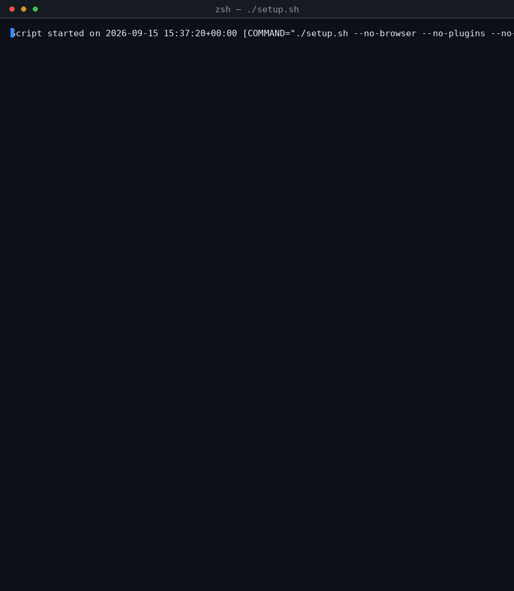
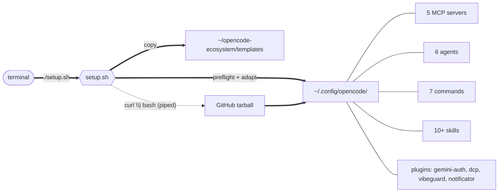

# setup-opencode

One-command setup for a fully-featured [OpenCode](https://opencode.ai) AI coding agent environment.

[](#license)
[](https://github.com/kiraadityaa/setup-opencode/releases)
[](https://github.com/kiraadityaa/setup-opencode/actions/workflows/ci.yml)
[](#contributing)
[](#requirements)

---

## What you get

Everything runs on free tiers and free models. No API keys required to start.

| Component | Details |
|---|---|
| **5 MCP servers** | context7 (docs), gh_grep (code search), agent-browser (browser automation), filesystem, memory |
| **4 plugins** | gemini-auth, dynamic context pruning, vibeguard, notificator (desktop audio notifications) |
| **6 agents** | architect, docker-ops, docs-writer, reviewer, security, test-writer |
| **7 commands** | `/commit`, `/explain`, `/refactor`, `/release`, `/review`, `/security`, `/test` |
| **10 skills** | git-workflow, code-review, commit-conventions, database-sql, docs, node-backend, python, security-review, testing, typescript-react |
| **13 design skills** | vendored from [leonxlnx/taste-skill](https://github.com/leonxlnx/taste-skill) (MIT): design-taste-frontend, industrial-brutalist-ui, minimalist-ui, high-end-visual-design, redesign-existing-projects, stitch-design-taste, full-output-enforcement, gpt-taste, image-to-code, imagegen-frontend-web, imagegen-frontend-mobile, brandkit, design-taste-frontend-v1 |
| **19+ external skills** | cloned from anthropics/skills and vercel-labs/agent-browser |
| **2 project templates** | TypeScript/React, Python |
| **shell strategy** | command-shell context instructions loaded every session |

## Demo

A real `./setup.sh` run, captured live in a fresh environment.



## Quick start

```bash
git clone https://github.com/kiraadityaa/setup-opencode
cd setup-opencode
./setup.sh
```

Or without cloning:

```bash
curl -fsSL https://raw.githubusercontent.com/kiraadityaa/setup-opencode/main/setup.sh | bash
```

> [!NOTE]
> The installer only touches `~/.config/opencode/`. If a config already exists it is backed up to `~/.config/opencode.bak.<timestamp>` — never overwritten silently.

## How it works



The installer detects the environment and adapts automatically:

| Environment | Adaptation |
|---|---|
| Docker / container | `--no-sandbox` added to agent-browser |
| macOS | correct browser-install path |
| Node.js missing | installed via nvm |
| Piped install | payload downloaded from GitHub tarball |

## Configuration

### Flags

**Component selection**

| Flag | Description |
|---|---|
| `--no-browser` | Skip agent-browser + Chrome for Testing (~200 MB) |
| `--no-notificator` | Skip the desktop notification plugin |
| `--no-plugins` | Skip all npm plugin installs |
| `--no-skills` | Skip external skill repo clones |
| `--no-templates` | Skip project template deployment |

**Execution control**

| Flag | Description |
|---|---|
| `--dry-run` | Preview every action without changing anything |
| `--force` | Overwrite existing config (backup created first) |
| `--verbose` | Show every command as it runs |
| `--version` | Print the installer version |
| `--uninstall` | Remove all setup-opencode files |
| `--help` | Show usage |

### Examples

```bash
# Full install (recommended)
./setup.sh

# Minimal — no browser, no plugins
./setup.sh --no-browser --no-plugins

# Preview without making changes
./setup.sh --dry-run --verbose

# Reinstall after changes (existing config is backed up)
./setup.sh --force

# Remove everything
./setup.sh --uninstall
```

## First run

1. Log in to the free providers:
   ```bash
   opencode auth login
   ```
   GitHub Copilot (Claude and GPT models) and Google Gemini are free via device-flow / OAuth.
2. Launch OpenCode:
   ```bash
   opencode
   ```
3. Pick your model with `/models`. Defaults require no authentication:
   `opencode/big-pickle` (primary), `opencode/mimo-v2.5-free` (small).
4. Restart OpenCode after changing models.

> [!TIP]
> Everything already installed works the moment `opencode` starts — context7, gh_grep, memory, all agents, commands, and skills. Authentication only unlocks more model providers.

## Requirements

- **OS:** macOS, Linux, or Windows (WSL)
- **CLI:** `bash`, `curl`, `git`
- **Node.js:** v18+ (auto-installed via nvm when missing)

## Uninstall

```bash
./setup.sh --uninstall
```

This removes agents, commands, skills, instructions, plugins, `_deps/`, and templates. Your `~/.config/opencode/opencode.jsonc` and authentication are kept.

## FAQ

<details>
<summary>Do I need any API keys?</summary>

No. The default models (`opencode/big-pickle`, `opencode/mimo-v2.5-free`) work immediately. `opencode auth login` adds free GitHub Copilot and Google Gemini providers.
</details>

<details>
<summary>Is it safe to re-run?</summary>

Yes. The config is backed up to `~/.config/opencode.bak.<timestamp>` before any change, and without `--force` the installer asks before touching an existing config.
</details>

<details>
<summary>Does it work on Windows?</summary>

Native Windows is not supported. Use WSL: https://opencode.ai/docs/windows-wsl
</details>

<details>
<summary>Can I use my own paid models?</summary>

Yes. After setup, run `opencode auth login` for paid providers or run `/models` to switch to any model your account has access to.
</details>

<details>
<summary>What does the demo GIF show?</summary>

An unmodified run of `./setup.sh --no-browser --no-plugins --no-skills --no-notificator --no-templates --force` in a disposable environment. The same output you get locally.
</details>

## Project structure

```
setup-opencode/
├── setup.sh              # installer (single entry point)
├── VERSION               # current version (consumed by setup.sh --version)
├── CHANGELOG.md          # release history
├── CONTRIBUTING.md       # contributor guide
├── CODE_OF_CONDUCT.md    # community standards
├── SECURITY.md           # vulnerability reporting
├── payload/              # config shipped to ~/.config/opencode/
│   ├── opencode.jsonc    # config template
│   ├── agent/            # 6 agents
│   ├── command/          # 7 commands
│   ├── instructions/     # shell-strategy.md
│   ├── plugins/          # notificator plugin + sounds
│   └── skills/           # 23 skills (10 custom + 13 vendored taste-skill)
├── templates/            # ts-react, python project starters
├── assets/               # demo.gif, og-image.png
└── .github/
    ├── ISSUE_TEMPLATE/   # bug report + feature request forms
    ├── PULL_REQUEST_TEMPLATE.md
    ├── dependabot.yml
    └── workflows/        # CI: shellcheck, integration, nightly + release
```

## Contributing

Run `shellcheck setup.sh` before opening a PR. CI validates the script and the payload config on every push.

## License · Credits

Released under the [MIT license](LICENSE).

Built on these open-source projects: [OpenCode](https://opencode.ai) · [context7](https://context7.com) · [grep.app MCP](https://mcp.grep.app) · [agent-browser](https://github.com/vercel-labs/agent-browser) · [opencode-dcp](https://github.com/Opencode-DCP/opencode-dynamic-context-pruning) · [opencode-shell-strategy](https://github.com/JRedeker/opencode-shell-strategy) · [opencode-notificator](https://github.com/panta82/opencode-notificator) · [opencode-vibeguard](https://github.com/inkdust2021/opencode-vibeguard) · [opencode-gemini-auth](https://github.com/jenslys/opencode-gemini-auth) · [taste-skill](https://github.com/leonxlnx/taste-skill)